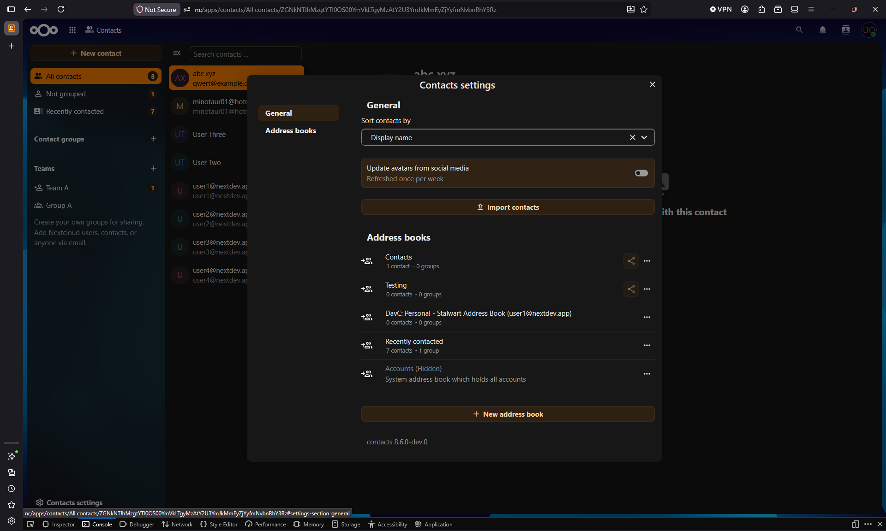

# Nextcloud DAV Connector

Nextcloud DAV Connector lets users connect external DAV services such as CalDAV and CardDAV to their Nextcloud account.

Once connected, remote calendars and address books are exposed inside Nextcloud as additional usable calendars and contacts sources, so they can be used alongside local Nextcloud data.

Connected resources can be accessed directly from Nextcloud for reading and writing, depending on the capabilities and permissions provided by the external DAV service.

## Quick configuration

1. Open Connected accounts and add a new DAV service connection.
2. Connect using either:
	- Manual setup: enter all service and account details yourself.
	- Auto discovery: if the required DNS records are configured correctly, service details can be discovered automatically.
3. After the service is connected, choose the remote collections you want to link.
4. Enable the collections by checking the relevant boxes, then click Save.
5. You can trigger synchronization manually, or wait for the background process.

## How it works

Once collections are linked:

1. The connected service is visible in the account settings.

2. Linked collections appear in Nextcloud Calendar and Contacts, and in desktop clients connected through DAV.

3. Linked collections are available in the system like local calendars and address books.
4. Background synchronization runs every few minutes, while create and update operations are live and instant.

## Development

To work on this app, fork and clone the full Nextcloud server repository first. The DAV Connector is bundled and lives at `apps/integration_davc/` inside that repository.
